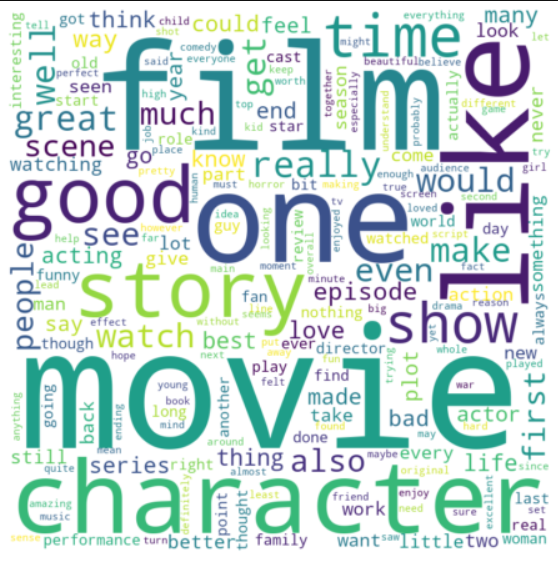

<!-- Improved compatibility of back to top link: See: https://github.com/othneildrew/Best-README-Template/pull/73 -->
<a name="readme-top"></a>


<h1 align="center">Movie-reviews</h1>

<table>
  <tr>
    <td width="500">
      
    </td>
    <td width="500">
      NLP analysis to understand public sentiment towards different films on IMDb. Implemented a pre-processing pipeline for EDA and compared multiple sentiment analysis models including TextBlob, VADER, and word2vec to identify the best approach for understanding the opinions expressed in the reviews.
    </td>
  </tr>
</table>


<!-- GETTING STARTED -->
## Getting Started

This is an example of how you may give instructions on setting up your project locally.
To get a local copy up and running follow these simple example steps.

### Dataset

Only first 2 parts (1M reviews) are used for this analysis. <a href="https://www.kaggle.com/datasets/ebiswas/imdb-review-dataset/">Download dataset.</a>


### Installation

* TextBlob
  ```sh
  pip install -U textblob
  ```
  
  
* VADER
  ```sh
  pip install vaderSentiment
  ```
* NLTK

  ```sh
  pip install --user -U nltk
  ```  

<!-- RESULTS -->
## Results
<table>
  <tr>
    <th>Model</th>
    <th>Accuracy</th>
  </tr>
  <tr>
    <td>TextBlob</td>
    <td>0.80</td>
  </tr>
  <tr>
    <td>VADER</td>
    <td>0.76</td>
  </tr>
  <tr>
    <td>Word2Vec</td>
    <td>0.87</td>
  </tr>
</table>


